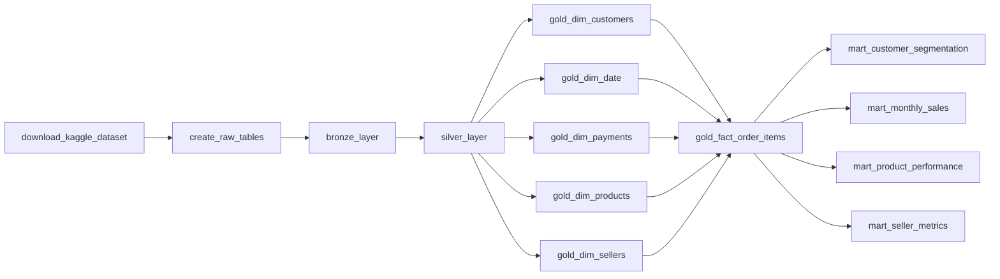

# Data Pipeline for Olist Brazilian E-commerce

## Project Overview
This project builds an automated ELT pipeline to extract dataset from Kaggle API, process, and analyze sales, product performance, and customer in Olist Brazilian e-commerce. The pipeline is fully integrated within Docker and utilize Apache Airflow for workflow orchestration. Metabase is initially used for data visualization, but ended up using Power BI for data visualization.

## Data Pipeline Worflow

1. **Bronze Layer**
  - Use Kaggle API to extract dataset. You can find the dataset [here](https://www.kaggle.com/datasets/olistbr/brazilian-ecommerce)
  - Store raw data in PostgreSQL
  - Managed by `load_raw.py`

2. **Silver Layer**
   - Process raw data into cleaned and standardized dataset
   - Check data quality issues

3. **Gold Layer**
   - Create star-schema with 5 dimension tables and 1 fact table

4. **Mart Layer**
   - Create ad-hoc SQL queries for business-analytics use

## Orchestration
The full pipeline is orchestrated with Apache Airflow with the following order :

## Dashboard
The final dashboard was built in Power BI and covers three areas:
- Sales overview — total revenue, orders, customers, average order value, monthly sales trend, and month-over-month growth
- Product performance — top-selling categories, sales vs order volume by category, and top products by units sold
- Customer analysis — RFM-based customer segmentation (Champions, Loyal, Potential, Churned)
  
## Technologies Used
-  Apache Airflow – Workflow orchestration
-  PostgreSQL – Data storage
-  Docker – Containerization
-  Power BI – Data visualization

